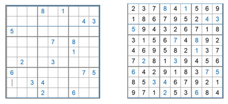

# Sudoku!

## The Birth of an Idea

One blistery Saturday I was sitting on my bed, doing Sudoku obviously, and I had a thought: I wonder if I could make a python script that could do Sudoku :thinking-face: So the premise of this challenge was born!

## A Simple Puzzle

Sudoku is a rather simple game tbh there is pretty much only one rule:

> In a grid of 9X9 boxes, fill in the box so that there are no repeating numbers (1-9) in each of the nine columns, nine rows, and nine 3x3 boxes.

Every Sudoku starts with a few numbers already filled in so that allow you to start to determine where the rest of the numbers go, some are easy while others can be very difficult depending on how many initial numbers it gives you.

Logically I thought that a script could easily check each box for these three conditions and assign it a temporary possible value and if there is only one possible value that could go in that spot then it fills in the box. And thus looping thru all the empty boxes until they are all filled. The idea would be that as numbers that only have one possible value get filled, the other boxes (when looped back to for another check) will learn and eliminate possible values. 

This is literally the way you solve a Sudoku so how hard could it be to tell a machine to do that? Especially when loops are so common in coding.

## The Road Ahead

There are a few hurdles that I recognize will need to be jumped in order for this project to be successful: 

1) Figure out how to look at the values by not only row and column, but by 3x3 boxes (*I'll call them quadrants from now on*), suggesting I need a quardinate system to identify those blocks.

2) Learn how to create the 9x9 grid that will show the Sudoku as a data vizual.

3) Vizualize the looping so create a live depiction of the program completeing the Sudoku.

Funny enough, I feel like the visualization part of this will be one of the harder things to do. I don't think there will be anything super crazy with the loops of rows and column, besides figuring out the quardinate system. And that doesn't include making the vizual a live feed of the program filling it out. That is just the eventual vision that I have and who knows, I might as well shoot for the moon.

It is also important to note that I will be focusing on just the classic 9x9 Sudoku and will not be trying to do the more complext shapes that you can find out there, maybe in the future if this project doesn't prove to be impossible ;)

## First Step:
### **Single Missing Values in a Column**

I first needed to validate if I could solve a sudoku square by looking at the columns only. This definitely is only one step in the process and I have so far only figured it out for very simple single value missing. This is the purpose of the `sudoku_column.py` script.

**Results from this test proved:**

- I can input an unfinished sudoku, in form of a matrix turned dataframe, and output a finished sudoku. 
- I can find the missing squares and fill it based on the missing values in the column.
- I was able to create a function that given the row and column the empty box is found, will return the respecitve quadrant it is found in.

Beginning Sudoku:

|     | A   | B   | C   | D   | E   | F   | G   | H   | I   |
| --- | --- | --- | --- | --- | --- | --- | --- | --- | --- |
| a   |   1 |   2 |   3 |   4 |   5 |   6 |   7 |   8 |   9 |
| b   |   4 |   5 |   6 |   7 |   8 |   9 |   1 |   2 |   3 |
| c   |   7 |   8 |   9 |   1 |   2 |   3 |   4 |   5 |   6 |
| d   |   0 |   3 |   4 |   5 |   6 |   7 |   8 |   9 |   1 |
| e   |   5 |   6 |   7 |   8 |   9 |   1 |   2 |   3 |   4 |
| f   |   8 |   9 |   1 |   2 |   3 |   4 |   0 |   6 |   7 |
| g   |   3 |   4 |   5 |   6 |   7 |   8 |   9 |   1 |   2 |
| h   |   6 |   7 |   8 |   0 |   1 |   2 |   3 |   4 |   5 |
| i   |   9 |   1 |   2 |   3 |   4 |   5 |   6 |   7 |   8 |

Resulting Sudoku:

|     | A   | B   | C   | D   | E   | F   | G   | H   | I   |
| --- | --- | --- | --- | --- | --- | --- | --- | --- | --- |
| a   |   1 |   2 |   3 |   4 |   5 |   6 |   7 |   8 |   9 |
| b   |   4 |   5 |   6 |   7 |   8 |   9 |   1 |   2 |   3 |
| c   |   7 |   8 |   9 |   1 |   2 |   3 |   4 |   5 |   6 |
| d   | [2] |   3 |   4 |   5 |   6 |   7 |   8 |   9 |   1 |
| e   |   5 |   6 |   7 |   8 |   9 |   1 |   2 |   3 |   4 |
| f   |   8 |   9 |   1 |   2 |   3 |   4 | [5] |   6 |   7 |
| g   |   3 |   4 |   5 |   6 |   7 |   8 |   9 |   1 |   2 |
| h   |   6 |   7 |   8 | [9] |   1 |   2 |   3 |   4 |   5 |
| i   |   9 |   1 |   2 |   3 |   4 |   5 |   6 |   7 |   8 |

**What still needs to be done:**

- Replicating the same result but for row-wise and quadrant-wise orientation. The latter of which will be much more difficult to execute.
- I need to be able to handle if there are multiple missing values in a column (which hopefully adding in checking row-wise and quadrant-wise will help with that).
- On top of handling multiple missing values, I need to be able to store possible values that can be overridden if one of the values is fill in later in a corresponding row, column, or quadrant.

## Second Step:
### **Single Missing Values in a Row**

I was able to do the same thing as before but by the rows, this just took some modifying of the for loop as seen in `sudoku_rows.py`. 

Other changes I made with this round, was to implement a module, that is storing all of my custom functions such as `find_missing()` and (most recently) `generate_sudoku()`. This new function will allow me to just run and generate a new sudoku and specify the difficulty of the sudoku. Mostly just using difficulty = 1 for now as that is the most simplist with only 1 missing value per row/column/quadrant (so 9 total missing values). This is going to be used for testing in these initial attempts.

*New Simple Sudoku Output:*

|     | A   | B   | C   | D   | E   | F   | G   | H   | I   |
| --- | --- | --- | --- | --- | --- | --- | --- | --- | --- |
| a   |   1 |   2 |   3 |   4 |   5 |   6 |   7 | [8] |   9 |
| b   |   4 |   5 | [6] |   7 |   8 |   9 |   1 |   2 |   3 |
| c   |   7 |   8 |   9 |   1 |   2 | [3] |   4 |   5 |   6 |
| d   | [2] |   3 |   4 |   5 |   6 |   7 |   8 |   9 |   1 |
| e   |   5 |   6 |   7 |   8 | [9] |   1 |   2 |   3 |   4 |
| f   |   8 |   9 |   1 |   2 |   3 |   4 | [5] |   6 |   7 |
| g   |   3 |   4 |   5 |   6 |   7 |   8 |   9 |   1 | [2] |
| h   |   6 |   7 |   8 | [9] |   1 |   2 |   3 |   4 |   5 |
| i   |   9 | [1] |   2 |   3 |   4 |   5 |   6 |   7 |   8 |

**What still needs to be done:**

- Replicating the same result in a quandrant-wise fashion. This might be more difficult, becuase I will need to specify the quadrant the missing value is in first and then turn the quadrant into an array to check for which values are missing.
- I need to be able to handle if there are multiple missing values in a column (which hopefully adding in checking row-wise and quadrant-wise will help with that).
- On top of handling multiple missing values, I need to be able to store possible values that can be overridden if one of the values is fill in later in a corresponding row, column, or quadrant.

## Third Step:
### **Single Missing Values in a Quadrant**

Now with `sudoku_quads.py` I can do the same things as the rows and columns, but by quadrant. This was only possible when using two functions